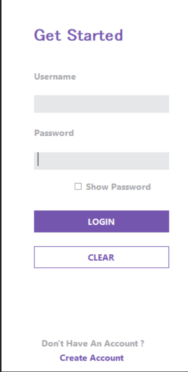

# Register-Login
User login and Registeration system using dotnet framework and Microsoft Access as database.
(https://www.codingwithcalvin.net/building-net-framework-applications-with-github-actions/)
(https://www.timheuer.com/blog/building-net-framework-apps-using-github-actions/)

#### Note: (CI can't be implemented as .NET Framework is not avaliable for github Actions)

# Screenshots
- 
- 
- 
- 
